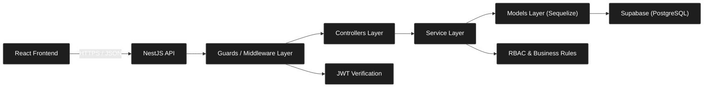

# Cooperative Education Management System

Cooperative Education Management System is a **Full-stack web application** for managing cooperative education workflows among students, advisors, and HR (companies). The system features a React frontend and a NestJS backend, implementing JWT-based authentication, role-based access control (RBAC), and activity logging with Supabase (PostgreSQL).

## Tech Stack

### Frontend 
- **Build Tool:** Vite
- **Library:** React
- **Language:** TypeScript (.tsx)
- **Styling:** CSS
- **API Integration:** Axios

### Backend 
- **Framework:** NestJS (Node.js)
- **Language:** TypeScript
- **Database:** PostgreSQL (Hosted on Supabase)
- **ORM:** Sequelize
- **Security:** JWT (JSON Web Token), bcrypt
- **Code Quality:** SonarQube

---

## System Architecture

- `frontend` handles UI, routing, local state, and API requests with attached JWT
- `backend/modules` encapsulates related features and manages dependencies
- `backend/controllers` receives HTTP requests, validates DTOs, and returns JSON responses
- `backend/services` contains business rules such as project applications, approvals, and RBAC enforcement
- `backend/guards` handles JWT verification and backend permission checks
- `Supabase (PostgreSQL)` stores users, role-specific profiles (Students, Advisor, HR, Company, ProjectManager), projects, applications, reports, and activity logs

## Security & Authentication Flow

The system implements a secure, stateless authentication mechanism tailored for multi-role access (Students, Advisors, HR, Company, ProjectManager):

1. **Registration:** Account creation is strictly restricted to `HR` and `Company` roles to ensure system integrity and prevent unauthorized user generation. The `backend` enforces security policies, hashes credentials via `bcrypt`, and stores them securely in `Supabase`.
2. **Authentication:** All users (Students, Advisors, PM, etc.) must log in with authorized credentials created or approved by the system. Upon success, the API issues:
   - `accessToken`: Delivered in the JSON response payload.
   - `refresh_token`: Stored inside an `HttpOnly` cookie to mitigate XSS (Cross-Site Scripting) attacks.
3. **Request Authorization:** The `React frontend` manages the access token state and attaches it via the `Authorization: Bearer <token>` header for every protected API request.
4. **Access Control:** Every incoming request is strictly intercepted and validated by NestJS guards:
   - `JwtAuthGuard`: Verifies the token's signature, integrity, and expiration status.
   - `RolesGuard`: Cross-checks the user's role against specific endpoint permissions (e.g., only students are permitted to submit reports).
5. **Exception Handling:** Any request with a missing, tampered, or unauthorized token is instantly rejected with a `401 Unauthorized` or `403 Forbidden` response.

## Authorization Design

The system uses JWT claims plus backend permission checks. Role checks are not trusted from the frontend alone.

### Roles
- `HR`
- `STUDENT`
- `ADVISOR`
- `ADMIN`

### Role Journey
- `HR` lands on project management pages: add project, edit project, and deletion requests
- `STUDENT` lands on internship pages: project applications and progress tracking
- `ADVISOR` lands on management pages: project/student approvals and status updates
- `ADMIN` lands on system control pages: user management, role updates, and deletion approval

### Backend Authorization
- All protected routes are grouped under `JwtAuthGuard`
- JWT signature and token type are verified by the backend
- Permissions are checked by `RolesGuard`
- Database access is restricted by role-specific queries

### Permission Matrix

| Feature | Company | Students | Advisor | Admin |
| :--- | :---: | :---: | :---: | :---: |
| **Add/Edit Projects** | Yes | No | No | No |
| **Request Project Deletion** | Yes | No | No | No |
| **Apply Projects** | No | Yes | No | No |
| **Cancle Projects Application** | No | Yes | No | No |
| **Submit Progress** | No | Yes | No | No |
| **Approve/Reject Projects** | No | No | Yes | No |
| **Approve/Reject Students** | No | No | Yes | No |
| **Change Student Status** | No | No | Yes | No |
| **Manage Users (Add/Del)** | No | No | No | Yes |
| **Reset Password / Edit Role** | No | No | No | Yes |
| **Approve Deletion Request** | No | No | No | Yes |
| **Edit Profile** | Yes | No | No | No |
| **Login** | Yes | Yes | Yes | Yes |

### Database Access Control
- **Same table, different permission:**
    - TABLE `USERS` every role can access their own data with `WHERE userID = ?` except `ADMIN` who can access to all users
    - TABLE `REPORT` for `STUDENT` can access their own report only and `ADVISOR` can read all report of students in advise
    - TABLE `PROJECT` for `STUDENT` can read only project that already be approved , `ADVISOR` can read and update project in advise or project that waiting for approval, `HR` can access their own project only
    - TABLE `APPLICATION` `STUDENT` can read and delete only their own applications, `ADVISOR` can read and update only application of student in advice project 
- **Different table by role:**
    - only `ADMIN` can access system logs from the `ACTIVITY_LOGS` table
    - `STUDENT` access their personal data from `STUDENTS` table
    - `ADVISOR` access their personal data from `ADVISOR` table
    - `HR` access their personal data from `HR` table
    - `HR` access specific records from `COMPANY` tables
 
## Security Measures (OWASP Mapping)

| Area | Implementation | OWASP Mapping |
| --- | --- | --- |
| Password hashing | Passwords are hashed with `bcrypt` only | OWASP Password Storage Cheat Sheet |
| Salt | Salt is automatic through bcrypt | OWASP Password Storage Cheat Sheet |
| No plaintext password | Passwords are never stored or returned in plaintext | OWASP Password Storage Cheat Sheet |
| Password policy | New passwords require minimum length, common-password blocking, and bcrypt byte-limit protection | OWASP Authentication Cheat Sheet |
| JWT verification | Backend verifies JWT signature, token type, and expiration on protected requests | OWASP Authentication Cheat Sheet |
| Backend role enforcement | Role and permission checks are enforced in backend middleware | OWASP Authorization guidance |
| HTTPS enforcement | Production rejects non-HTTPS requests and frontend disallows insecure backend URLs outside localhost | OWASP Transport Layer Protection |
| Secret management | JWT secret and OAuth client secret are loaded from environment variables, not hardcoded in source code | OWASP Secrets Management |
| SQL Injection prevention | GORM parameterized queries are used instead of string-built SQL | OWASP SQL Injection Prevention Cheat Sheet |
| XSS prevention | React escapes rendered values by default and the app does not render user-provided HTML | OWASP XSS Prevention Cheat Sheet |
---
